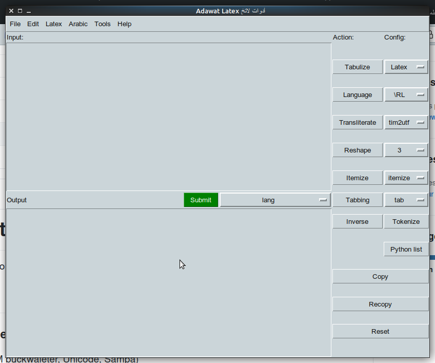

[](https://github.com/linuxscout/adawat-latex/issues)
[](https://github.com/linuxscout/adawat-latex/network)
[](https://github.com/linuxscout/adawat-latex/stargazers)
[](https://github.com/linuxscout/adawat-latex/blob/master/LICENSE)

# Adawat-latex
Text tools to handle conversion into Latex with arabic support


## Features
*  Language features
   * Transliterate (TIM buckwaleter, Unicode, Sampa)
   * Detect Arabic language segments
   * Inverse text
   * Tokenize
* tables and Lists  for Latex
	* Convert a CSV to tabular
	* Converts lines into itemize or enumerate environment
	* Converts CSV lines into tabbing environment
	* Detect and delimite arabic language for Arabtex environment
	* Reshape a lines into CSV tabs
* Compiste command:
	You can recopy the out put to do more command on the smae text, for example:
	* reshape and convert into table
	* detect laguage and itemize
	* detect laguage and tabulize

### Usage 
 * Command line
 ```
 python adawat-latex.py  -c tabulize -f inputfile.txt
 ```

 * GUI
 ```
 python adawat-latex-gui.py
 ```

 

 ## How To use
 ### Itemize and Enumerate
 if you have a list of point and you want to convert it to a list, for example:

 use "itemize" with parameters option [itemize, enumerate]


 ```text
One entry in the list
Another entry in the list
Another entry in the list
Another entry in the list
 ```
  Output will be 
  ```tex
  \begin{itemize}
\item One entry in the list
\item Another entry in the list
\item Another entry in the list
\item Another entry in the list 
\end{itemize}
  ```
  ```tex
  \begin{enumerate}
\item One entry in the list
\item Another entry in the list
\item Another entry in the list
\item Another entry in the list 
\end{enumerate}

  ```

### Tables and lists
* CSV to latex table
* CSV to  latex tabbing
* Reshape a list into a table
* CSV to JSON or Python table
* Composite commands
#### CSV to table
If you have a table on Excel or text with tab as délimeter, you can choose "tabulize" to convert it into:
* Latex
* HTML
* Markdown
* Input as csv or text delimited by tab
```csv
head1	Head2	head3
cell	cell2	cell3
cell	cell2	cell3
cell	cell2	cell3
cell	cell2	cell3
```

* Output as Tex
```tex
\begin{table}
 \begin{tabular}{|c|c|c|}
\hline head1 & Head2 & head3\\
\hline cell & cell2 & cell3\\
\hline cell & cell2 & cell3\\
\hline cell & cell2 & cell3\\
\hline cell & cell2 & cell3\\
\hline

    \end{tabular}

    \caption{mytab:table}

    \label{mytab:table}

     \end{table}                 
```
 * Output as HTML
```html
<table>
<tr><td>head1 </td><td>Head2 </td><td>head3</td></tr>
<tr><td>cell </td><td>cell2 </td><td>cell3</td></tr>
<tr><td>cell </td><td>cell2 </td><td>cell3</td></tr>
<tr><td>cell </td><td>cell2 </td><td>cell3</td></tr>
<tr><td>cell </td><td>cell2 </td><td>cell3</td></tr>
</table>
```

 * Output as Markdown
```md
head1 | Head2 | head3
cell | cell2 | cell3
cell | cell2 | cell3
cell | cell2 | cell3
cell | cell2 | cell3
```


#### Make a latex tabbing
If you have a table on Excel or text with tab as délimeter, you can choose "tabbing" to convert it into :
* Latex  tabbing 

You can choose different separator (tab, space, etc..) in the input text
```csv
head1	Head2	head3
cell	cell2	cell3
cell	cell2	cell3
cell	cell2	cell3
cell	cell2	cell3
```

* Output as Tex
```tex
 \begin{tabbing}
\hspace{4cm}\=\hspace{4cm}\=\hspace{4cm}\=\kill
head1 \> Head2 \> head3\\
cell \> cell2 \> cell3\\
cell \> cell2 \> cell3\\
cell \> cell2 \> cell3\\
cell \> cell2 \> cell3\\
\end{tabbing}                 
```

##### Reshape a list into a table
Some programs copy tables as list instead of table or matrix, which generate problems.
The "Reshape" command helps to handle this issue

* Original table 
```text
1	one
2	two
3	three
```
 * The input as it has copied format of the table, 
```python
1
one
2
two
3
three
```
* Out pur with "Reshape" command with "2" columns as option
```
1	one
2	two
3	three
```


#### CSV to Python list
If you have a list of key values in CSV file, you can convert it to python list, or Json, by using "Python List" command.

The first line is the name of table "Table", and colomns are separated by tabulation.

* Input as CSV
```text
mytable
1	one
2	two
3	three
```
 * Output as python list
```python
mytable={}
mytable['1']={}
mytable['one']={}
mytable[u'one'][u'1']='one'
mytable[u'one'][u'2']='two'
mytable[u'one'][u'3']='three'
```


### Language features
* Transliterate arabic text between (utf, tim bukwalter, Sampa)
* Detect Arabic segment and tag it
* Tokenize : convert text into list of words
* Inverse text
#### Transliterate 
 The transliterate convere arabic text like this :
* from Unicode(UTF8) to Tim Bulkwalters transcription,
* from Tim Bulkwalters transcription  to Unicode(UTF8)
* from Tim Bulkwalters transcription  to SAMPA transcription

 * Input as text
```text
السلام عليكم ورحمة الله وبركاته
```
 * Output as SAMPA
```text
a:lsla:m ?'ljkm wrxmh a:llh wbrka:th
```

#### Detect Arabic segment and tag it

If you have a mix text and you want to put it within a Tex document by using Polyglossia, ArabTex or ArabXeTex packages, you can use "language command" with options (\RL, \begin{arab} environment}


* Input as text
```text
The man said السلام عليكم and he goes.
```
 * Output as Tex with "\RL" option
```tex
The man said  \RL{السلام عليكم}  and he goes.
```
 * Output as Tex with "arab environment" option
```tex
The man said  
\begin{arab}[utf] السلام عليكم \end{arab} 
 and he goes.
```

#### Tokenize

IIf you want to split text into words or tokens, just use tokenize

* Input as text
```text
The man said السلام عليكم and he goes.
```
 * Output as list of word
```
The
man
said
السلام
عليكم
and
he
goes
.
```


#### Inverse text
Some programs generate an arabic inversed text, which needs to be inversed.
It can be used for english, or just to inverse a text.

* Input as text
```text
.seog eh dna مكيلع مالسلا dias nam ehT
```
 *  Output as inversed  text
```
The man said السلام عليكم and he goes.
```


